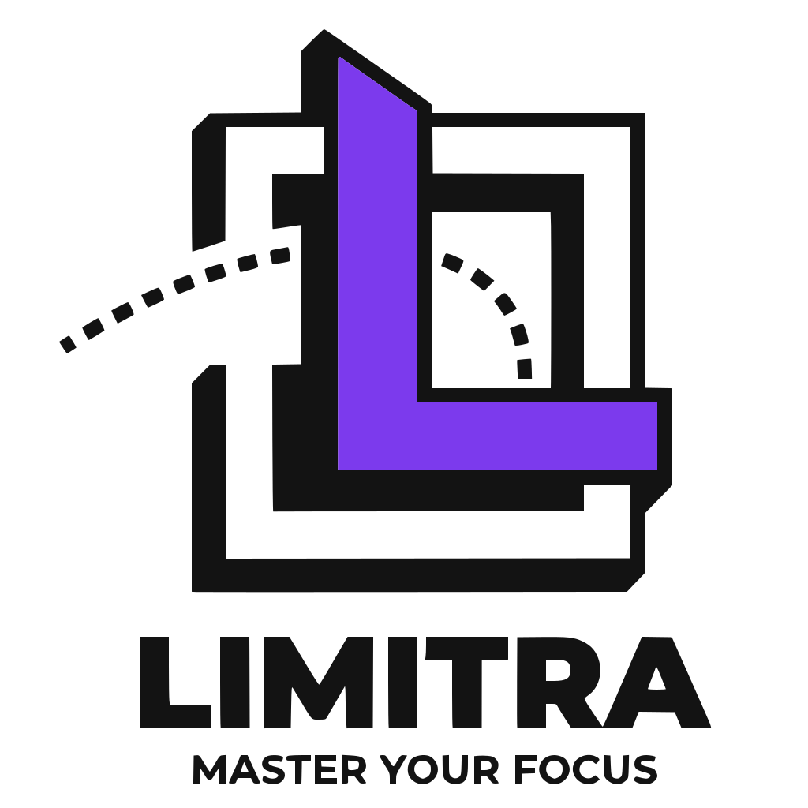
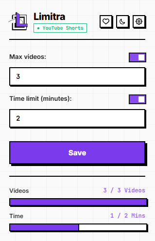
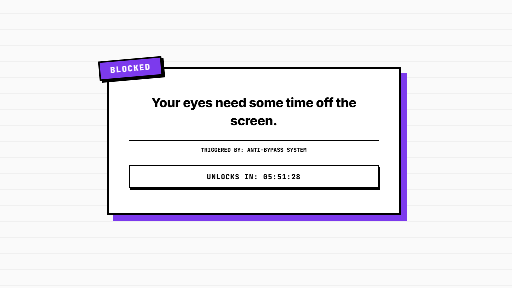
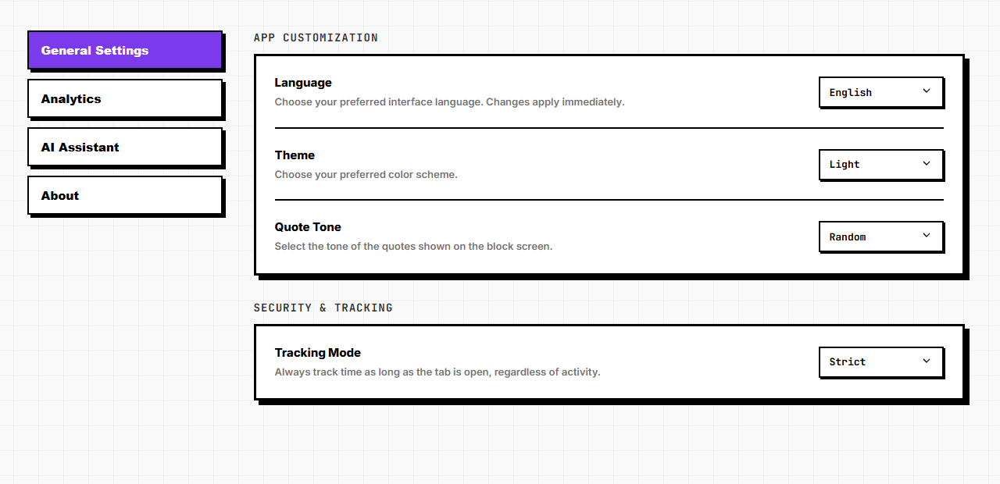

# Limitra™

[](https://github.com/YazanAmmar/limitra/releases)
[](https://chromewebstore.google.com/detail/limitra/gbokphfkigfopbhfeeeiibifoaaldcjo)
[](https://github.com/YazanAmmar/limitra/releases)
[](https://github.com/YazanAmmar/limitra/tree/main/src/i18n/locales)
[](https://github.com/YazanAmmar/limitra/stargazers)
[](https://github.com/YazanAmmar/limitra/issues)

<p align="center">
  <picture>
    <source media="(prefers-color-scheme: dark)" srcset="assets/logo-dark.svg">
    <source media="(prefers-color-scheme: light)" srcset="assets/logo-light.svg">
    
  </picture>
</p>

<div align="center">

[Report a Bug](https://github.com/YazanAmmar/limitra/issues) · [limitra.xyz](https://limitra.xyz) · [Support the Project](https://limitra.xyz/#support)

</div>

> **Hard limits for your social media time (not reminders).**

Limitra is a Chromium extension designed to **enforce hard limits on how you spend your time online** - not with reminders or nudges, but with strict blocking once your limits are reached, helping you break out of endless scrolling loops.

## Table of Contents

- [Overview](#overview)
- [Screenshots](#screenshots)
- [Why Limitra?](#why-limitra)
- [Features](#features)
- [Supported Languages](#supported-languages)
- [Project Structure](#project-structure)
- [Getting Started](#getting-started)
  - [Install Limitra](#install-limitra-recommended)
  - [Build from source](#build-from-source-developers)
- [Changelog (Summary)](#changelog-summary)
- [Roadmap](#roadmap)
- [Contributing](#contributing)
- [License](#license)
- [Trademark](#trademark)
- [Contact / Links](#contact--links)

## Overview

Limitra is a Chromium extension designed to **enforce hard limits on YouTube** - both Shorts and regular Watch pages.

Instead of reminders or nudges, it applies strict blocking once your limits are reached - helping you break out of endless scrolling loops.

You can define limits based on:

- Number of videos watched
- Active session time
- Or both combined - with your choice of **Strict** (either limit triggers) or **Flexible** (both limits must be reached) enforcement

When a limit is exceeded, Limitra immediately blocks playback using a fullscreen overlay that cannot be easily bypassed.

Built on Chrome Manifest V3, Limitra focuses on reliability, resistance to tampering, and a fast, distraction-free experience.

## Screenshots

> See Limitra in action:

### Popup Dashboard

Quick access to your limits, real-time stats, and progress tracking.

<p align="center">

</p>

### Blocking Overlay

Limitra immediately blocks access when limits are reached - no reminders, no bypass.

<p align="center">

</p>

### Settings / Command Center

Configure your limits, tracking mode, block condition, block duration, theme, and behavior from a dedicated control panel.

<p align="center">

</p>

## Why Limitra?

- **Hard limits that actually stop you**: playback is paused, muted, and blocked the moment you hit your limit.
- **Two dimensions of control**: track by watched video count, session time, or both together.
- **Your rules, your conditions**: choose whether one limit or both limits must be reached before enforcement kicks in.
- **Designed against easy workarounds**: Limitra watches for counter resets, suspicious wipes, and hidden overlays - and locks settings during active blocks.
- **Built for practical daily use**: quick popup stats, clear settings, theme support, and multilingual UI.

## Features

### Enforcement Core

- Dual-limit system based on **video count** and **active session time**
- **Block Condition** setting: `Strict` (OR - either limit triggers a block) or `Flexible` (AND - both limits must be reached)
- **Customizable block duration**: choose how long a block lasts, from 15 minutes to 24 hours
- Fullscreen enforcement overlay triggered instantly on limit breach
- Dynamic enforcement reason display: `Count`, `Time`, `Time & Video Limits`, or `Bypass`
- Automatic pause and mute of active videos
- Disables playback-related keyboard shortcuts
- Settings are locked during an active block to prevent last-second changes

### Platform Support

- **YouTube Shorts**: tracks video count and session time with a 1.5-second watch threshold
- **YouTube Watch**: tracks regular video viewing with a 10-second watch threshold
- **Hot-swap detection**: automatically switches tracking context when navigating between Shorts and Watch without a page reload

### Tracking & Intelligence

- `Strict`: tracks total time while the tab is open
- `Playing Only`: counts only active playback time
- `Smart`: tracks playback and meaningful interaction
- Background heartbeat to prevent time-skipping and detect idle gaps

### Anti-Bypass Protection

- Detects manual counter resets and storage manipulation
- Prevents overlay removal via DevTools or CSS tampering
- Identifies rapid storage wipe attempts
- Smart session lock: block duration is frozen at enforcement time to prevent clock manipulation
- Central `isCurrentlyBlocked()` gatekeeper enforced before any punishment executes
- Enforces immediate blocking when suspicious behavior is detected

### User Interface

- Live usage stats and progress bars in the popup
- Context-aware popup: auto-selects the active platform or shows a platform selector on unsupported pages
- Dedicated **Command Center** dashboard for managing limits, modes, block condition, block duration, themes, and behavior
- Motivational quote system with multiple tone styles: Random, Gentle, Harsh, Philosophical, Sarcastic, Stoic
- Brutalist tooltip components for inline option explanations
- Confirmation modal for destructive actions (e.g., global settings reset)
- Light, Dark, and System themes
- Clean and responsive UI across all views

## Supported Languages

- English
- Arabic

> Automatic RTL/LTR layout switching

## Project Structure

```text
src/
├── adapters/                 # Chrome-specific implementations (Composition Layer)
│   └── chrome/
│       ├── alarm-manager.ts
│       ├── connection-manager.ts
│       ├── message-bus.ts
│       ├── storage-driver.ts
│       └── tab-manager.ts
├── app/
│   └── orchestrator.ts       # Wires core components, owns the content-side block flow
├── core/
│   ├── interfaces/           # Abstract contracts (Ports) - no platform dependencies
│   │   ├── alarm-manager.ts
│   │   ├── connection-manager.ts
│   │   ├── message-bus.ts
│   │   ├── platform-adapter.ts
│   │   └── tab-manager.ts
│   ├── storage/              # Persistence layer - settings, stats, sessions, security
│   ├── background-orchestrator.ts # Environment-agnostic background logic
│   ├── limiter.ts            # Pure counting and limit enforcement logic
│   ├── session.ts            # Heartbeat, activity tracking, and unload handling
│   ├── tracker.ts            # Delegates URL observation to the active adapter
│   └── messenger.ts          # Typed message bus wrapper
├── platforms/
│   ├── youtube/index.ts      # YouTube Shorts + Watch adapter (with hot-swap support)
│   └── generic/index.ts      # Fallback adapter
├── ui/
│   ├── popup/                # Extension popup UI
│   ├── settings/             # Command Center dashboard
│   ├── overlay/              # Blocking screen (renderer, controller, persistence)
│   └── components/           # Reusable UI components (tooltip, modal, custom-select)
├── i18n/                     # Internationalization (types, singleton, locale files)
├── _locales/                 # Chrome manifest-level translations
├── assets/                   # Icons and static assets
├── background.ts             # Composition Root - Service Worker entry point
├── content.ts                # Composition Root - injected page script entry point
└── types.ts                  # Shared types (PlatformId, AppAction, messages)
```

## Getting Started

### Install Limitra (Recommended)

The easiest and most secure way to install Limitra and receive automatic updates:

- **[Add to Chrome](https://chromewebstore.google.com/detail/limitra/gbokphfkigfopbhfeeeiibifoaaldcjo)**

> Firefox and Safari support coming soon.

### Build from source (Developers)

If you want to contribute or build the extension locally:

#### Prerequisites

- Node.js 18+
- Chrome / Chromium

#### Install & Build

```bash
git clone https://github.com/YazanAmmar/limitra.git
cd limitra
npm install

# Run code formatting, linting, and type checking
npm run check

# Development build (with sourcemaps for debugging)
npm run dev

# Production build (minified, ready for publishing)
npm run build
```

#### Load in Chrome

1. Open `chrome://extensions`
2. Enable **Developer mode** (top right)
3. Click **Load unpacked**
4. Select the `dist/` folder

#### Run Tests

```bash
npm test
```

## Changelog (Summary)

For full release notes, see [CHANGELOG.md](./CHANGELOG.md).

- **1.1.0**: YouTube Watch support, flexible block conditions (AND/OR), customizable block duration, improved anti-bypass logic, new UI components (modal, tooltip), and major internal architecture upgrades.
- **1.0.0**: First stable release with dual-limit enforcement, blocking overlay, anti-bypass protection, popup stats, settings dashboard, theme support, and English/Arabic localization.

## Roadmap

- Expand beyond YouTube into other high-distraction platforms (TikTok, Instagram Reels, etc.)
- Add richer analytics and historical usage views.
- Improve anti-bypass hardening for more edge cases.
- Introduce smarter recovery, reset, and scheduling options.
- Refine the public website, docs, and release assets around the extension.

## Contributing

Want to contribute to Limitra?

Please read the contribution guidelines before opening a pull request: [CONTRIBUTING.md](./CONTRIBUTING.md)

If you find Limitra useful and want to support its development: [Support & Sponsor](https://limitra.xyz/#support)

## License

Limitra is licensed under the Business Source License 1.1 (BSL).

- Production Use: Allowed, provided you do not offer Limitra to third parties as a commercial service, SaaS, or monetized product.
- Commercial Use: Offering Limitra as a hosted service, SaaS, or monetized product requires explicit permission.
- Open Source Conversion: This version automatically converts to the Apache License 2.0 on January 1, 2030.

> This license allows production use, but restricts offering Limitra as a commercial hosted service or SaaS.

For full details, please see the [LICENSE](./LICENSE) file.

## Trademark

"Limitra" is a trademark of Yazan Ammar.

You are welcome to fork, modify, and contribute to this project.

> To avoid confusion, please do not use the name "Limitra", logo, or branding in derivative works without permission.

For collaborations or commercial inquiries, feel free to [reach out](mailto:support@limitra.xyz).

## Contact / Links

- **Website**: <https://limitra.xyz>
- **Chrome Web Store**: <https://chromewebstore.google.com/detail/limitra/gbokphfkigfopbhfeeeiibifoaaldcjo>
- **Privacy Policy**: <https://limitra.xyz/privacy>
- **Support**: <https://limitra.xyz/#support>
- **GitHub Repo**: <https://github.com/YazanAmmar/limitra>
- **Releases**: <https://github.com/YazanAmmar/limitra/releases>
- **Issues**: <https://github.com/YazanAmmar/limitra/issues>
- **Email**: [support@limitra.xyz](mailto:support@limitra.xyz)
